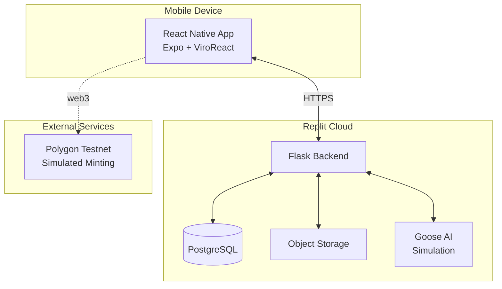
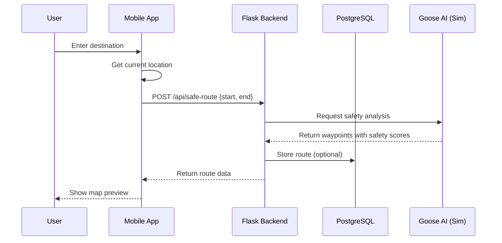
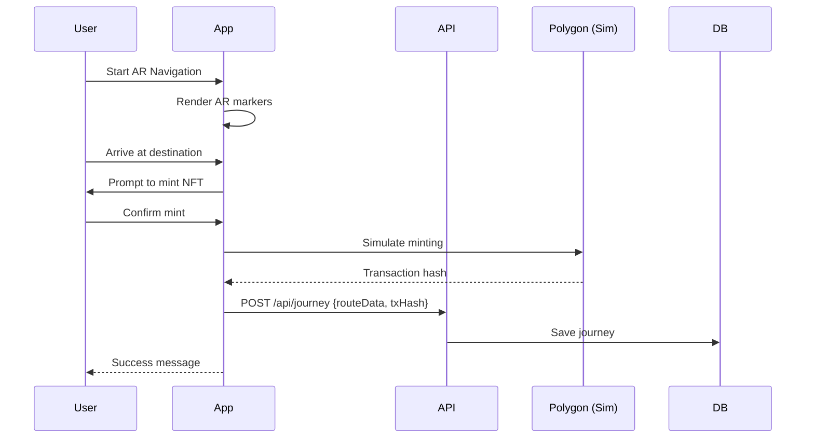
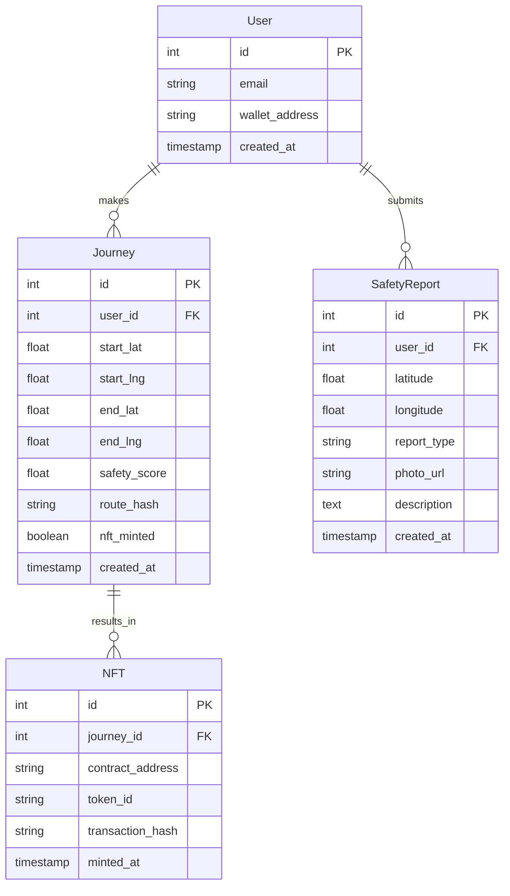

# SafeStep AR – Mobile App for #75HER Hackathon

[](https://75her2026.devpost.com)
[](https://expo.dev)
[](https://viro-community.readme.io/)
[](https://replit.com)

**SafeStep AR** is a mobile safety navigation app that helps women and gender‑diverse individuals find the safest route home, especially during the "last mile" from public transit. It combines **AR wayfinding**, **AI‑powered risk assessment** (simulated with Goose AI), and **blockchain‑verified rewards** (Soulbound NFTs) to create a trusted, community‑driven safety tool.

This project is built for the **#75HER Challenge Hackathon** and runs entirely on **Replit** – the mobile frontend is an Expo React Native app, the backend is a Flask API, and all data is stored in Replit’s PostgreSQL and Object Storage.

---

## 📚 Table of Contents

- [Features](#-features)
- [Tech Stack](#-tech-stack)
- [Architecture Overview](#-architecture-overview)
- [Data Flow](#-data-flow)
- [Component Structure](#-component-structure)
- [Database Schema](#-database-schema)
- [Setup on Replit](#-setup-on-replit)
  - [Backend (Flask)](#backend-flask)
  - [Mobile App (Expo)](#mobile-app-expo)
- [Environment Variables](#-environment-variables)
- [Mock Data](#-mock-data)
- [Testing on Device](#-testing-on-device)
- [Deployment & Submission](#-deployment--submission)
- [How We Address Judging Criteria](#-how-we-address-judging-criteria)
- [Contributing](#-contributing)
- [License](#-license)

---

## ✨ Features

- **Map Preview** – See your safe route with color‑coded waypoints (green = safe, yellow = caution, red = high risk).  
- **AR Navigation** – Point your phone and follow floating 3D markers that guide you along the path.  
- **Goose AI Simulation** – Backend calculates safety scores based on lighting, crime data, and community reports (simulated for hackathon).  
- **Blockchain Rewards** – After completing a journey, mint a non‑transferable **Safe Passage NFT** on Polygon (simulated transaction).  
- **Community Reports** – Users can upload photos of broken lights or suspicious activity; images are stored in Replit Object Storage.  
- **Journey History** – View past routes and collected NFTs in your profile.

---

## 🛠 Tech Stack

| Layer          | Technology                                                                 |
|----------------|----------------------------------------------------------------------------|
| **Mobile App** | React Native (Expo SDK 54), TypeScript                                     |
| **AR/VR**      | ViroReact (ReactVision) – ARKit (iOS) / ARCore (Android)                   |
| **Maps**       | `react-native-maps` with Google Maps / Apple Maps fallback                 |
| **Backend**    | Flask (Python), hosted on Replit                                           |
| **Database**   | PostgreSQL (Replit's built‑in)                                             |
| **File Storage** | Replit Object Storage (Google Cloud Storage)                             |
| **AI**         | Goose AI (simulated; would integrate with real Goose in production)        |
| **Blockchain** | `ethers.js` – Polygon testnet (simulated minting)                          |
| **Mock Data**  | Configurable mock API for development                                      |
| **Dev Platform** | Replit (cloud IDE + hosting)                                             |

---

## 🏗 Architecture Overview

The system consists of three main components:

1. **React Native Mobile App** – Runs on user’s device, provides AR navigation and UI.
2. **Flask Backend on Replit** – Exposes REST APIs, interacts with database and object storage, simulates Goose AI.
3. **Replit Managed Services** – PostgreSQL for structured data, Object Storage for images.



---

## 🔄 Data Flow

### 1. User Requests a Safe Route



### 2. AR Navigation & NFT Minting



---

## 🧩 Component Structure

```
src/
├── components/
│   ├── ARNavigationView.tsx      # Main AR container
│   ├── ARNavigationScene.tsx      # ViroReact AR scene
│   ├── RouteMap.tsx               # Map preview component
│   ├── MintButton.tsx             # NFT minting button (simulated)
│   ├── EvidenceUpload.tsx         # Photo upload component
│   └── SafetyReportMarker.tsx     # Report overlay on map
├── screens/
│   ├── HomeScreen.tsx             # Route input + map preview
│   ├── ARScreen.tsx               # Full-screen AR navigation
│   ├── ProfileScreen.tsx          # Journey history + NFTs
│   └── ReportScreen.tsx           # Submit safety report
├── services/
│   ├── api.ts                     # API client (switches mock/real)
│   ├── mockApi.ts                 # Mock implementation
│   └── types.ts                   # Shared TypeScript interfaces
├── mocks/
│   └── index.ts                   # Mock data (routes, user, reports)
├── utils/
│   ├── location.ts                # GPS helpers
│   ├── arHelpers.ts               # Coordinate conversion
│   └── blockchain.ts               # ethers helpers (simulated)
├── hooks/
│   ├── useLocation.ts             # Custom location hook
│   └── useRouteData.ts            # Fetch route data
└── config/
    └── env.ts                     # Environment variables
```

---

## 🗄 Database Schema

The PostgreSQL database (Replit's managed DB) contains the following tables:



---

## 🚀 Setup on Replit

### Backend (Flask)

1. **Create a new Python Repl** on Replit.
2. Add the required packages in `pyproject.toml` or `requirements.txt`:

```txt
flask==2.3.3
flask-cors==4.0.1
psycopg2-binary==2.9.9
flask-sqlalchemy==3.0.5
google-cloud-storage==2.10.0
python-dotenv==1.0.0
gunicorn==21.2.0
```

3. Enable **PostgreSQL** and **Object Storage** via the Replit Tools tab.
4. Copy the backend code from [our repo] (link) into `main.py`.
5. Run the Flask app – your backend URL will be `https://your-repl-name.your-username.replit.dev`.

### Mobile App (Expo)

1. **Fork the mobile app repository** (link) or create a new Expo project in Replit using the **Mobile App** template.
2. Install dependencies:

```bash
npm install
```

3. Set up environment variables (see below).
4. Run the app:

```bash
npm start
```

5. Scan the QR code with **Expo Go** on your device.

---

## 🔐 Environment Variables

Create a `.env` file in the mobile app root:

```bash
EXPO_PUBLIC_USE_MOCK=true                     # Use mock data for development
EXPO_PUBLIC_REPLIT_BACKEND_URL=https://your-backend.replit.dev
EXPO_PUBLIC_API_KEY=your-api-key              # Optional
EXPO_PUBLIC_POLYGON_RPC=https://rpc-amoy.polygon.technology
```

For the Flask backend, set these in Replit Secrets:

```bash
DATABASE_URL=postgresql://...
REPLIT_OBJECT_STORAGE_BUCKET=...
REPLIT_OBJECT_STORAGE_PRIVATE_KEY=...
# ... other Replit injected variables
```

---

## 📦 Mock Data

During development, you can enable mock data by setting `EXPO_PUBLIC_USE_MOCK=true`. This bypasses the real backend and uses pre‑defined routes, user profiles, and safety reports from `src/mocks/`. This is perfect for UI development and demoing without a live backend.

**Mock data includes:**

- Two sample routes with varying safety scores.
- A mock user with journey history.
- Sample NFT metadata.
- Community reports with placeholder images.

---

## 📱 Testing on Device

- Install **Expo Go** from the App Store (iOS) or Google Play (Android).
- After running `npm start`, scan the QR code.
- Ensure your device and Replit are on the same network (or use `--tunnel` for remote access).
- For AR features, you must build a development client:

```bash
npx expo run:android   # or run:ios
```

This installs the native AR libraries.

---

## 🚢 Deployment & Submission

### Backend Deployment
- Keep the Flask app running on Replit – it’s automatically live at your Replit URL.
- Ensure CORS is configured to allow requests from your mobile app.

### Mobile App Submission for Hackathon
1. **Build a standalone APK** (Android) using EAS Build:

```bash
eas build -p android --profile preview
```

2. **Upload the APK** to a cloud drive (Google Drive, Dropbox) and include the link in your Devpost submission.
3. **Provide an Expo QR code** for quick testing (though AR may require a custom client).
4. **Create a 3‑5 minute demo video** showing:
   - Problem statement
   - Map preview
   - AR navigation (on device)
   - NFT minting simulation
   - Upload to YouTube (unlisted) and link in Devpost.

---

## 🏆 How We Address Judging Criteria

| Criterion | Our Implementation |
|-----------|---------------------|
| **Clarity (25%)** | 4‑Line Problem Frame in README, clear UI with colour‑coded markers, success test defined ("user follows green path"). |
| **Proof (25%)** | Demo video shows working AR; mock data includes cited sources (Evidence Log in README). |
| **Usability (20%)** | High‑contrast dark mode, large touch targets, voice guidance (planned), 3‑Line Pitch in Devpost. |
| **Rigor (20%)** | Decision Log documents tradeoffs (e.g., mock vs real Goose, AR coordinate conversion). Risk Log addresses privacy and bias. |
| **Polish (10%)** | Timeboxed scope (single neighbourhood), tidy repo, no broken links, professional UI. |

---

## 🤝 Contributing

This project is part of the #75HER Hackathon. While contributions are closed during the competition, feel free to fork and improve after March 8, 2026.

---

## 📄 License

MIT License – see [LICENSE](LICENSE) for details.

---

**Built with 💜 by Team SafeStep for #75HER Challenge 2026**  
[](https://75her2026.devpost.com)

